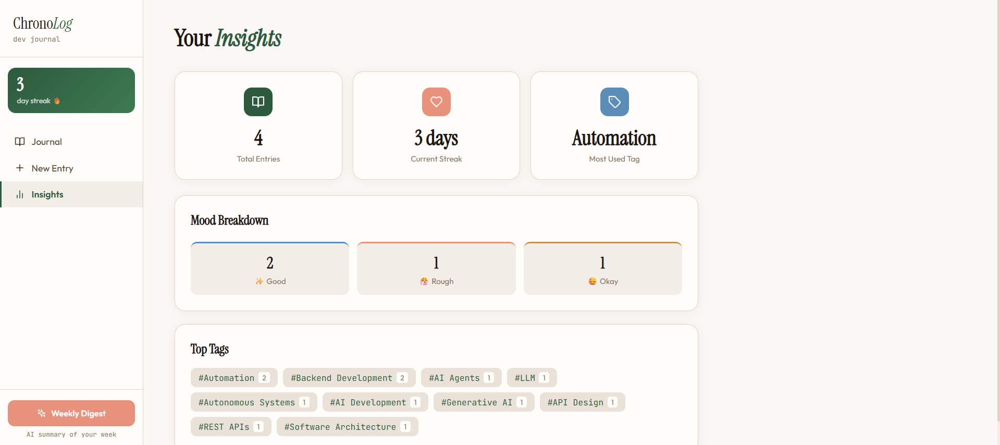
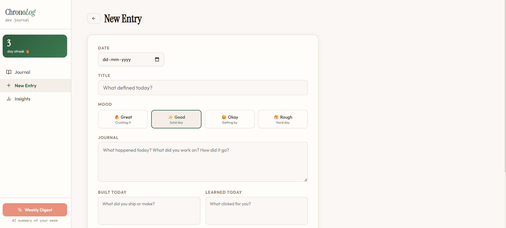
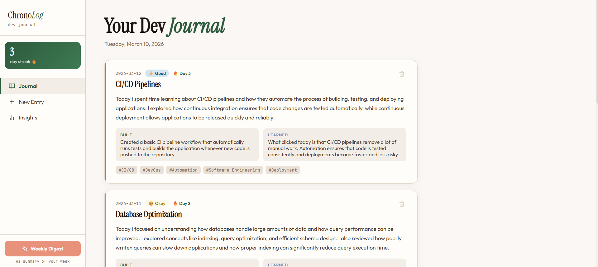
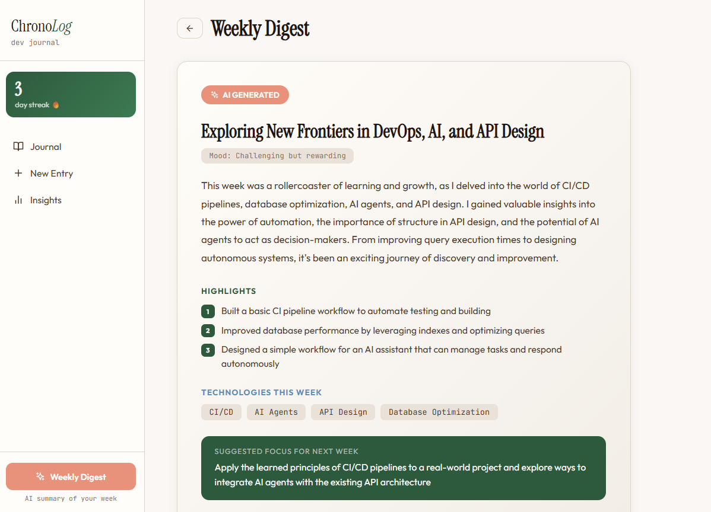

# ChronoLog 
AI-powered developer journal with streak tracking

A daily dev journal that tracks what you built, learned, and felt — then generates an AI weekly digest with insights, mood trends, and suggestions for next week.

---




---
FRONTEND_URL = https://chronolog-1.onrender.com


## Features
- **Daily entries** — title, body, mood emoji, built/learned fields, tags, date
- **Streak tracking** — auto-calculated from entry dates, displayed on dashboard
- **AI weekly digest** — headline, summary, highlights, tech stack recap, mood trend, next-week suggestion
- **Stats dashboard** — mood breakdown, top tags, total entries, current streak
- **Sidebar navigation** — Journal, New Entry, Stats, Digest views
- Framer Motion page transitions + animated stat cards

---

## Stack
| | |
|---|---|
| Backend | FastAPI + SQLAlchemy + SQLite |
| AI | Groq LLaMA 3.3 70B |
| Frontend | React 18 + Vite |
| State | Zustand |
| Animations | Framer Motion |

---

## Quick Start

### 1. Backend
```bash
cd chronolog/backend
python -m venv venv && source venv/bin/activate
pip install -r requirements.txt

echo "GROQ_API_KEY=your_key_here" > .env

uvicorn app.main:app --reload
# → http://localhost:8000
```

### 2. Frontend
```bash
cd chronolog/frontend
npm install
npm run dev
# → http://localhost:5173
```

---

## API
| Method | Endpoint | Description |
|---|---|---|
| GET | `/api/logs` | All journal entries |
| POST | `/api/logs` | Create entry |
| PUT | `/api/logs/{id}` | Update entry |
| DELETE | `/api/logs/{id}` | Delete entry |
| GET | `/api/stats` | Mood counts, top tags, streak |
| POST | `/api/digest` | Generate AI weekly digest |
| GET | `/api/health` | Health check |

**Create entry body:**
```json
{
  "title": "Built the auth flow",
  "body": "Spent the day wiring up JWT...",
  "mood": "🔥",
  "built": "Auth service",
  "learned": "JWT refresh token patterns",
  "tags": ["auth", "backend"],
  "date": "2025-01-15"
}
```

---

## Deploy to Render

**Backend** — Web Service
- Root dir: `chronolog/backend`
- Build: `pip install -r requirements.txt`
- Start: `uvicorn app.main:app --host 0.0.0.0 --port $PORT`
- Env: `GROQ_API_KEY`
- **Add a persistent disk** at `/data` and set `DATABASE_URL=sqlite:////data/chronolog.db` so entries survive deploys

**Frontend** — Static Site
- Root dir: `chronolog/frontend`
- Build: `npm install && npm run build`
- Publish: `dist`

---

## Notes
- SQLite DB is created automatically on first run at `./chronolog.db`
- On Render free tier, the DB resets on each deploy unless you use a persistent disk
- For production, swap SQLite for PostgreSQL: `pip install psycopg2-binary` and update `DATABASE_URL`
